# LAB-1 
tanggal 11 agustus 2025

logging in mikrotik

Melakukan logging in ke mikrotik dengan beberapa cara :  
Sertakan langkah-langkah nya :

# 1. winbox 
   
      Cara yang Pertama yaitu menggunakan aplikasi winbox yang dapat didownload di mikrotik.com,

      berikut langkah nya:  
      a. Buka Winbox,  
      b. Klik Tab Neighbors lalu Refresh  
      c. Setelah muncul, pilih MAC Address   
      d. Login: admin, Password:    
      e. Klik Connect  

   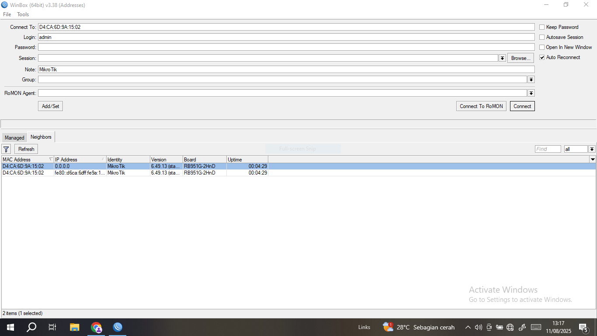

      f. jika sudah berhasil, maka akan muncul tampilan seperti ini:

   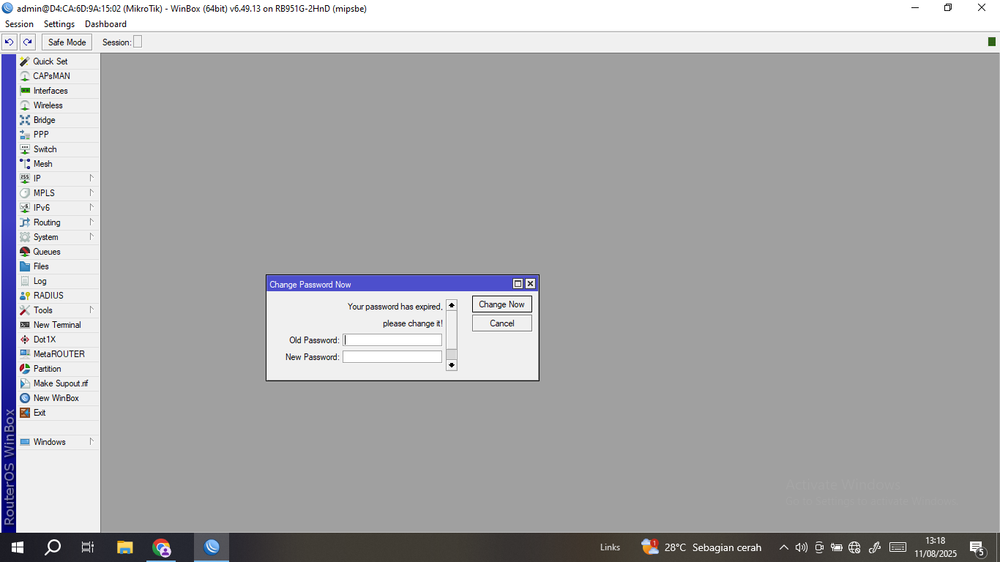

# 2. webfig 
   
      Cara kedua menggunakan webfig (menggunakan web browser)

      berikut langkah nya:  
      a. Buka chrome (aplikasi web browser)  
      b. Pada URL ketik IP Address: 192.168.88.1 (ip default mikrotik)  
      c. Setelah itu, maka akan muncul tampilan mikrotik dalam mode GUI pada web
      browser

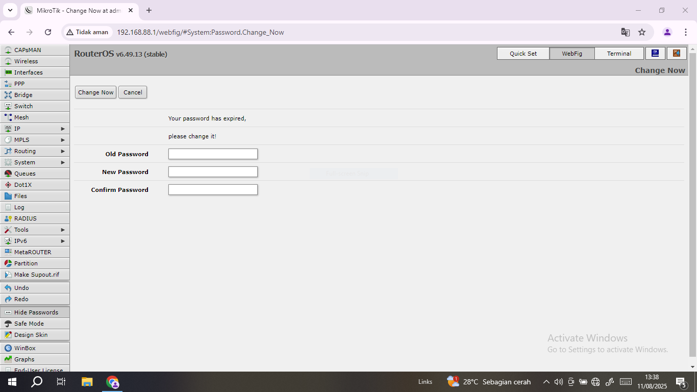

# 3. Telnet 

      Cara ketiga menggunakan telnet pada aplikasi putty.

      berikut langkah nya:  
      a. Buka putty  
      b. Klik Tab Telnet  
      c. Ketik IP Address: 192.168.88.1 (ip default mikrotik)  
      d. Ketik Port: 23 (port default telnet)  
      e. Klik Open 

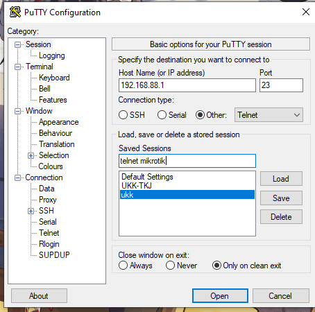

      f. Login: admin, no Password, Tekan Enter

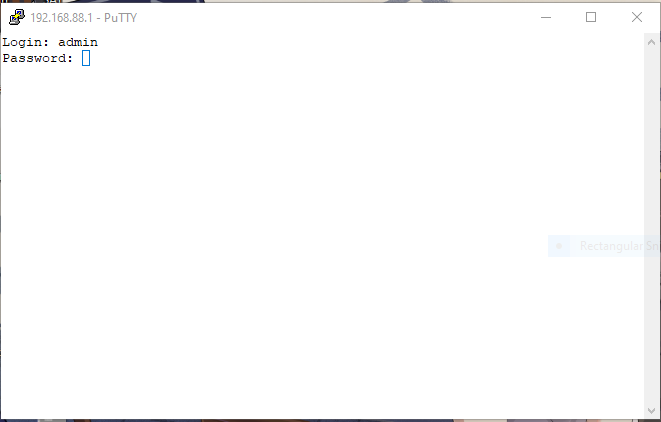

      g. Setelah berhasil login, maka akan muncul tampilan mikrotik dalam mode CLI

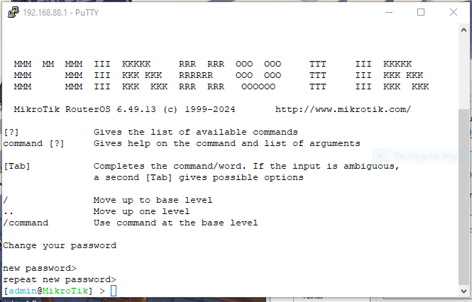

# 4. SSH 

      Cara yang keempat menggunakan SSH pada aplikasi putty

      berikut langkah nya:  
      a. Buka putty  
      b. Klik Tab SSH  
      c. Ketik IP Address: 192.168.88.1 (ip default mikrotik)  
      d. Ketik Port: 22 (port default telnet)  
      e. Klik Open 

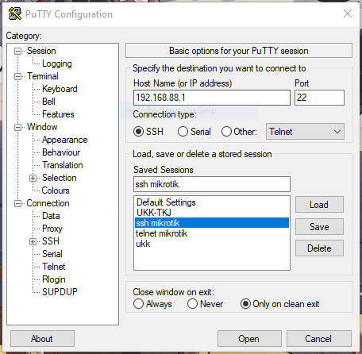

      f. Login: admin, no password, klik enter 

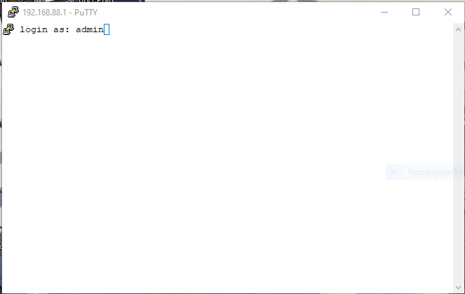

      g. jika berhasil login, maka akan muncul tampilan mikrotik dalam mode CLI

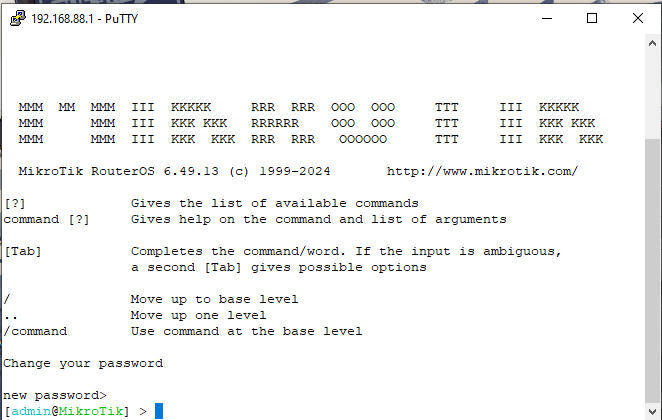

# 5. FTP (filezilla) 

      Akses mikrotik via FTP (filezilla) bermanfaat untuk upload dan download file ke router mikrotik.
      
      berikut langkah nya:   
      a. Buka filezilla  
      b. Isi Host: 192.168.88.1 (ip default mikrotik)  
      c. Login: admin dan without password:   
      e. Ketik Port: 21 (port default ftp)  
      f. Klik Quickconnect

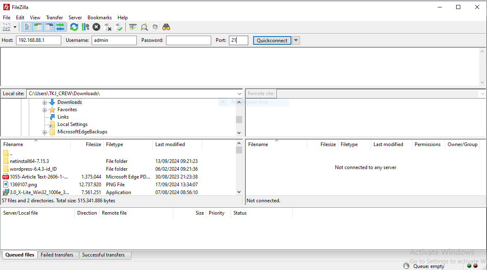

      g. Setelah berhasil login, maka akan muncul tampilan mikrotik dalam mode CLI

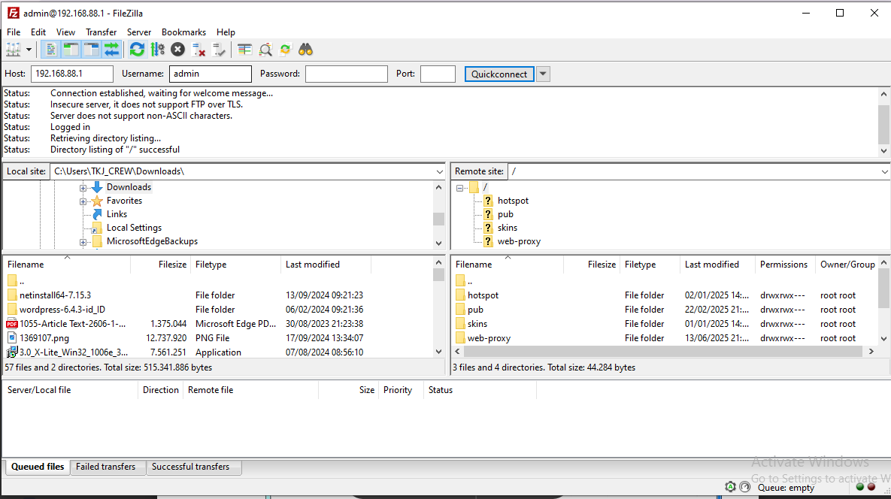

# 6. Mikrotik pro 
      Yang keenam, yaitu menggunakan mikrotik pro app di android. Yang bisa di download di play store  
      untuk mengconect kan nya membutuhkan koneksi wireless/wi-fi.  

      Berikut langkah nya:  
      a. Buka app mikrotik pro    
      b. Isi Address: 192.168.88.1 (ip default mikrotik)    
      c. Username: admin dan without password:     
      d. Klik Quickconnect  

      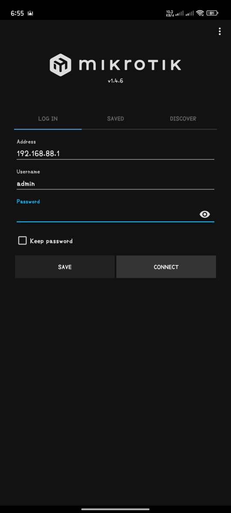
      
      e. jika berhasil login akan muncul tampilan seperti ini:

      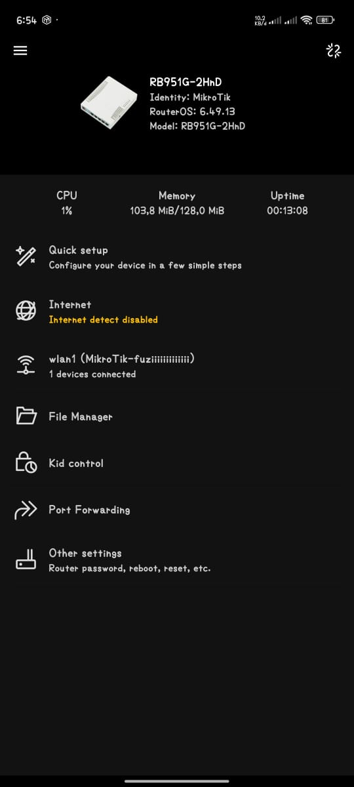

      
# 7. console 
      Yang terakhir menggunakan console via PuTTY (Windows)
      a. Buka PuTTY.  
      b. Pilih Connection type: Serial.  
      c. Masukkan port.  
      d. Set baud rate ke 115200 (default MikroTik).  
      e. Klik Open.  
      Setelah koneksi terbuka, kamu akan melihat tampilan login:  
      f. Login: Masukkan username (default: admin)  
      g. Masukkan password (kosong untuk default)  
      h.Tekan Enter  

# Kesimpulan:
      dari 7 cara login mikrotik tersebut adalah:
      
      Terdapat 7 cara untuk mengakses atau melakukan remote/log in ke perangkat MikroTik,   
      di antaranya menggunakan Winbox, SSH, Telnet, WebFig, dan FileZilla.   
      Masing-masing metode memiliki keunggulan dan karakteristik tersendiri,   
      baik dari segi tampilan antarmuka, kemudahan penggunaan, maupun tingkat keamanannya.   
      Keberagaman ini memberikan fleksibilitas bagi admin jaringan untuk  
      memilih metode yang paling sesuai dengan kebutuhan dan kondisi jaringan,   
      sehingga pengelolaan MikroTik menjadi lebih efektif dan efisien.  

