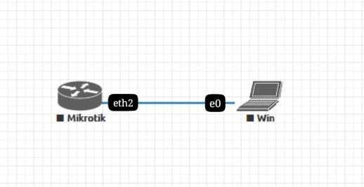

# LAB-1 
tanggal 11 agustus 2025

logging in mikrotik 

Lakukan logging in ke mikrotik dengan beberapa cara :

Tuliskan langkah-langkah nya :

1. winbox
   Cara Pertama yang paling mudah menurut saya adalah menggunakan aplikasi winbox yang
dapat didownload di mikrotik.com, berikut langkah nya:

a. Buka Winbox,

b. Klik Tab Neighbors lalu Refresh

c. Setelah muncul, pilih MAC Address

d. Login: admin

Password:

e. Klik Connect

